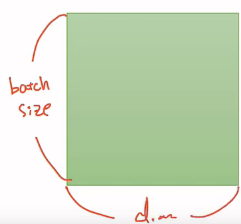

# 파이토치 패키지 기본 구성

### 1. torch
- 메인 네임스페이스
-----

### 2. torch.autograd
- 자동 미분을 위한 함수 포함
- enable_grad/no_grad를 통해 자동 미분 on/off
- Function 클래스 : 자체 미분 가능 함수를 정의할 때 사용하는 클래스
----

### 3. torch.nn
- 신경망을 구축하기 위한 데이터 구조나 레이어
- RNN, LSTM 같은 레이어, ReLU와 같은 활성화 함수, MESLoss 같은 손실 함수
----

### 4. torch.optim
- SGD(확률적 경사 하강법)을 중심으로 한 파라미터 최적화 알고리즘 구현
----

### 5. torch.utils.data
- SGD의 반복 연산을 실행할 때 사용되는 미니 배치 유틸리티 함수 포함
----

### 6. torch.onnx
- ONNX(Open Neural Network Exchange)의 포맷으로 모델을 익스포트(export)할 때 사용
- ONNX : 서로 다른 딥 러닝 프레임워크 간에 모델을 공유할 때 사용하는 포맷
----


# 텐서 조작하기 1

### 1. 벡터, 행렬 그리고 텐서(Vector, Matrix and Tensor)


- 벡터 = 1차원 텐서, 2차원 행렬 = 2차원 텐서. 그리고 3차원 텐서, 4차원 텐서, 5차원 텐서 등

### 2. PyTorch Tensor Shape Convention

####  2D Tensor(Typical Simple Setting)

- |t| = (Batch size, dim)
  2차원 텐서의 크기 |t|를 (batch size × dimension)으로 표현하였을 경우

예시 :

훈련 데이터 하나의 크기를 256이라고 해봅시다. [3, 1, 2, 5, ...] 이런 숫자들의 나열이 256의 길이로 있다고 상상하면됩니다. 

다시 말해 훈련 데이터 하나 = 벡터의 차원은 256입니다. 만약 이런 훈련 데이터의 개수가 3000개라고 한다면, 현재 전체 훈련 데이터의 크기는 3,000 × 256입니다. 

행렬이니까 2D 텐서네요. 3,000개를 1개씩 꺼내서 처리하는 것도 가능하지만 컴퓨터는 훈련 데이터를 하나씩 처리하는 것보다 보통 덩어리로 처리합니다. 

3,000개에서 64개씩 꺼내서 처리한다고 한다면 이 때 batch size를 64라고 합니다. 그렇다면 컴퓨터가 한 번에 처리하는 2D 텐서의 크기는 (batch size × dim) = 64 × 256입니다.

#### 3D Tensor(Typical Computer Vision) - 비전 분야에서의 3차원 텐서


- |t| = (batch size, width, height)
- 세로는 batch size, 가로는 너비(width), 그리고 안쪽으로는 높이(height)

#### * 3D Tensor(Typical Natural Language Processing) - NLP 분야에서의 3차원 텐서


- |t| = (batch size, length, dim)
- 자연어 처리는 보통 (batch size, 문장 길이, 단어 벡터의 차원)이라는 3차원 텐서를 사용

### 3. 파이토치 텐서 선언하기(PyTorch Tensor Allocation)

```python
import torch
```

#### 1) 1D with PyTorch
```python
t = torch.FloatTensor([0., 1., 2., 3., 4., 5., 6.])
print(t)
```
입력
```python
print(t.dim())  # rank. 즉, 차원
print(t.shape)  # shape
print(t.size()) # shape

```

출력 결과
```python
1
torch.Size([7])
torch.Size([7])
```

인덱스 접근, 슬라이싱 가능
```python
print(t[0], t[1], t[-1])  # 인덱스로 접근
print(t[2:5], t[4:-1])    # 슬라이싱
print(t[:2], t[3:])       # 슬라이싱
```

```python
tensor(0.) tensor(1.) tensor(6.)
tensor([2., 3., 4.]) tensor([4., 5.])
tensor([0., 1.]) tensor([3., 4., 5., 6.])
```

#### 2) 2) 2D with PyTorch

```python
t = torch.FloatTensor([[1., 2., 3.],
                       [4., 5., 6.],
                       [7., 8., 9.],
                       [10., 11., 12.]
                      ])
print(t)
```
```python
tensor([[ 1.,  2.,  3.],
        [ 4.,  5.,  6.],
        [ 7.,  8.,  9.],
        [10., 11., 12.]])

```

```python
print(t.dim())  # rank. 즉, 차원
print(t.size()) # shape
```
```python
2
torch.Size([4, 3])
```

슬라이싱
```python
print(t[:, 1]) # 첫번째 차원을 전체 선택한 상황에서 두번째 차원의 첫번째 것만 가져온다.
print(t[:, 1].size()) # ↑ 위의 경우의 크기
```
```python
tensor([ 2.,  5.,  8., 11.])
torch.Size([4])
```
첫번째 차원을 전체 선택한 상황에서 두번째 차원에서는 맨 마지막에서 첫번째를 제외하고 다 가져오는 경우
```python
print(t[:, :-1]) # 첫번째 차원을 전체 선택한 상황에서 두번째 차원에서는 맨 마지막에서 첫번째를 제외하고 다 가져온다.
```
```
tensor([[ 1.,  2.],
        [ 4.,  5.],
        [ 7.,  8.],
        [10., 11.]])
```

#### 3) 브로드캐스팅(Broadcasting)
- 파이토치에서는 자동으로 크기를 맞춰서 연산을 수행하게 만드는 브로드캐스팅이라는 기능을 제공
```
m1 = torch.FloatTensor([[3, 3]])
m2 = torch.FloatTensor([[2, 2]])
print(m1 + m2)
```
```
tensor([[5., 5.]])
```
아래는 벡터와 스칼라가 덧셈 연산을 수행하는 것을 보여줍니다. 물론, 수학적으로는 원래 연산이 안 되는게 맞지만 파이토치에서는 브로드캐스팅을 통해 이를 연산합니다.
```
# Vector + scalar
m1 = torch.FloatTensor([[1, 2]])
m2 = torch.FloatTensor([3]) # [3] -> [3, 3]
print(m1 + m2)
```
```
tensor([[4., 5.]])
```

원래 m1의 크기는 (1, 2)이며 m2의 크기는 (1,)입니다. 그런데 파이토치는 m2의 크기를 (1, 2)로 변경하여 연산을 수행합니다.

이번에는 벡터 간 연산에서 브로드캐스팅이 적용되는 경우
```
# 2 x 1 Vector + 1 x 2 Vector
m1 = torch.FloatTensor([[1, 2]])
m2 = torch.FloatTensor([[3], [4]])
print(m1 + m2)
```
```
tensor([4., 5.],
       [5., 6.]])
```

m1의 크기는 (1, 2) m2의 크기는 (2, 1)였습니다. 이 두 벡터는 원래 수학적으로는 덧셈을 수행할 수 없습니다. 그러나 파이토치는 두 벡터의 크기를 (2, 2)로 변경하여 덧셈을 수행합니다.
```
ed!# 브로드캐스팅 과정에서 실제로 두 텐서가 어떻게 변경되는지 보겠습니다.
[1, 2]
==> [[1, 2],
     [1, 2]]
[3]
[4]
==> [[3, 3],
     [4, 4]]
```
브로드캐스팅은 편리하지만, 자동으로 실행되는 기능이므로 사용자 입장에서 굉장히 주의해서 사용해야 합니다. 

만약, 두 텐서의 크기가 다르다고 에러를 발생시킨다면 사용자는 이 연산이 잘못되었음을 바로 알 수 있지만 브로드캐스팅은 자동으로 수행되므로 사용자는 나중에 원하는 결과가 나오지 않았더라도 어디서 문제가 발생했는지 찾기가 굉장히 어려울 수 있습니다.


# 텐서 조작하기(Tensor Manipulation) 2

#### 4) 뷰(View) - 원소의 수를 유지하면서 텐서의 크기 변경. 매우 중요!

파이토치 텐서의 뷰(View)는 넘파이에서의 리쉐이프(Reshape)와 같은 역할을 합니다.
```
t = np.array([[[0, 1, 2],
               [3, 4, 5]],
              [[6, 7, 8],
               [9, 10, 11]]])
ft = torch.FloatTensor(t)
print(ft.shape)
```
```
torch.Size([2, 2, 3])
```


#### 4-1) 3차원 텐서에서 2차원 텐서로 변경
```
print(ft.view([-1, 3])) # ft라는 텐서를 (?, 3)의 크기로 변경
print(ft.view([-1, 3]).shape)
```
```
tensor([[ 0.,  1.,  2.],
        [ 3.,  4.,  5.],
        [ 6.,  7.,  8.],
        [ 9., 10., 11.]])
torch.Size([4, 3])
```

현재 3차원 텐서를 2차원 텐서로 변경하되 (?, 3)의 크기로 변경하라는 의미입니다. 결과적으로 (4, 3)의 크기를 가지는 텐서를 얻었습니다.


내부적으로 크기 변환은 다음과 같이 이루어졌습니다. (2, 2, 3) -> (2 × 2, 3) -> (4, 3)

#### 정리
1. view는 기본적으로 변경 전과 변경 후의 텐서 안의 원소의 개수가 유지되어야 합니다.
2. 파이토치의 view는 사이즈가 -1로 설정되면 다른 차원으로부터 해당 값을 유추합니다.

#### 4-2) 3차원 텐서의 크기 변경

view로 텐서의 크기를 변경하더라도 원소의 수는 유지되어야 한다고 언급한 바 있습니다. 그렇다면 (2 × 2 × 3) 텐서를 (? × 1 × 3) 텐서로 변경하라고 하면 ?는 몇 차원인가요?

(2 × 2 × 3) = (? × 1 × 3) = 12를 만족해야 하므로 ?는 4가 됩니다.
```
print(ft.view([-1, 1, 3]))
print(ft.view([-1, 1, 3]).shape)
```
```
tensor([[[ 0.,  1.,  2.]],

        [[ 3.,  4.,  5.]],

        [[ 6.,  7.,  8.]],

        [[ 9., 10., 11.]]])
torch.Size([4, 1, 3])
```

#### 5) 스퀴즈(Squeeze) - 1인 차원을 제거한다.
스퀴즈는 차원이 1인 경우에는 해당 차원을 제거합니다.
실습을 위해 임의로 (3 × 1)의 크기를 가지는 2차원 텐서를 만들겠습니다.
```
ft = torch.FloatTensor([[0], [1], [2]])
print(ft)
print(ft.shape)
```
```
tensor([[0.],
        [1.],
        [2.]])
torch.Size([3, 1])
```
해당 텐서는 (3 × 1)의 크기를 가집니다. 두번째 차원이 1이므로 squeeze를 사용하면 (3,)의 크기를 가지는 텐서로 변경됩니다.
```
print(ft.squeeze())
print(ft.squeeze().shape)
```
```
tensor([0., 1., 2.])
torch.Size([3])
```
위의 결과는 1이었던 두번째 차원이 제거되면서 (3,)의 크기를 가지는 텐서로 변경되어 1차원 벡터가 된 것을 보여줍니다.

#### 6) 언스퀴즈(Unsqueeze) - 특정 위치에 1인 차원을 추가한다.
언스퀴즈는 스퀴즈와 정반대입니다. 특정 위치에 1인 차원을 추가할 수 있습니다.
실습을 위해 임의로 (3,)의 크기를 가지는 1인 차원 텐서를 만들겠습니다.
```
ft = torch.Tensor([0, 1, 2])
print(ft.shape)
```
```
torch.Size([3])
```
현재는 차원이 1개인 1차원 벡터입니다. 여기에 첫번째 차원에 1인 차원을 추가해보겠습니다. 첫번째 차원의 인덱스를 의미하는 숫자 0을 인자로 넣으면 첫번째 차원에 1인 차원이 추가됩니다.
```
print(ft.unsqueeze(0)) # 인덱스가 0부터 시작하므로 0은 첫번째 차원을 의미한다.
print(ft.unsqueeze(0).shape)
```
```
tensor([[0., 1., 2.]])
torch.Size([1, 3])
```
위 결과는 (3,)의 크기를 가졌던 1차원 벡터가 (1, 3)의 2차원 텐서로 변경된 것을 보여줍니다. 방금 한 연산을 앞서 배운 view로도 구현 가능합니다. 2차원으로 바꾸고 싶으면서 첫번째 차원은 1이기를 원한다면 view에서 (1, -1)을 인자로 사용하면됩니다.
```
print(ft.view(1, -1))
print(ft.view(1, -1).shape)
```
```
tensor([[0., 1., 2.]])
torch.Size([1, 3])
```
위의 결과는 unsqueeze와 view가 동일한 결과를 만든 것을 보여줍니다. 이번에는 unsqueeze의 인자로 1을 넣어보겠습니다.
인덱스는 0부터 시작하므로 이는 두번째 차원에 1을 추가하겠다는 것을 의미합니다. 현재 크기는 (3,)이었으므로 두번째 차원에 1인 차원을 추가하면 (3, 1)의 크기를 가지게 됩니다. 실습을 진행해보겠습니다.
```
print(ft.unsqueeze(1))
print(ft.unsqueeze(1).shape)
```
```
tensor([[0.],
        [1.],
        [2.]])
torch.Size([3, 1])
```
이번에는 unsqueeze의 인자로 -1을 넣어보겠습니다. -1은 인덱스 상으로 마지막 차원을 의미합니다.
이번에는 unsqueeze의 인자로 -1을 넣어보겠습니다. -1은 인덱스 상으로 마지막 차원을 의미합니다.
```
print(ft.unsqueeze(-1))
print(ft.unsqueeze(-1).shape)
```
```
tensor([[0.],
        [1.],
        [2.]])
torch.Size([3, 1])
```
맨 뒤에 1인 차원이 추가되면서 1차원 벡터가 (3, 1)의 크기를 가지는 2차원 텐서로 변경되었습니다.
#### 정리
view(), squeeze(), unsqueeze()는 텐서의 원소 수를 그대로 유지하면서 모양과 차원을 조절합니다.

#### 7) 타입 캐스팅(Type Casting)

텐서에는 자료형이라는 것이 있습니다. 각 데이터형별로 정의되어져 있는데, 예를 들어 32비트의 부동 소수점은 torch.FloatTensor를, 64비트의 부호 있는 정수는 torch.LongTensor를 사용합니다. GPU 연산을 위한 자료형도 있습니다. 예를 들어 torch.cuda.FloatTensor가 그 예입니다.

그리고 이 자료형을 변환하는 것을 타입 캐스팅이라고 합니다.

우선 실습을 위해 long 타입의 lt라는 텐서를 선언합니다.
```
lt = torch.LongTensor([1, 2, 3, 4])
print(lt)
```

```
print(lt.float())
bt = torch.ByteTensor([True, False, False, True])
print(bt)
print(bt.long())
print(bt.float())
```

```
tensor([1., 2., 3., 4.])
tensor([1, 0, 0, 1], dtype=torch.uint8)
tensor([1, 0, 0, 1])
tensor([1., 0., 0., 1.])
```

#### 8) 연결하기(concatenate)
